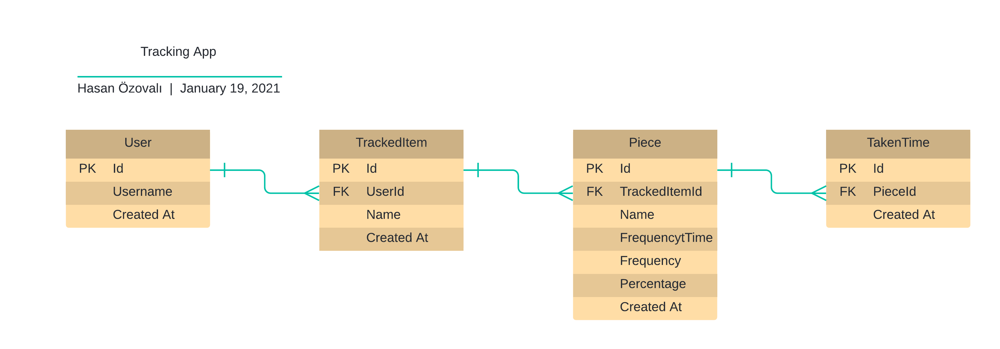

# Dr. Ti-API

This API is the backend of [Dr.Ti](https://github.com/ozovalihasan/track).

## Live Demo

Please connect your app by using [this URL](https://dr-ti-api.fly.dev/)

## Documentation
Please check [the detailed documentation.](https://dr-ti-api.fly.dev/api/docs)

## Built With

- Ruby on Rails
- RSpec API Doc Generator

## Getting Started

To get a local copy up and running follow these simple example steps.

### Prerequisites

Make sure Node.js is running on your local machine.

## Setup

- Clone this repository
- Open terminal
- Change directory by using `cd track-api`
- Run `bundle install`
- [Setup Postgresql](https://www.howtoforge.com/tutorial/ruby-on-rails-ror-with-postgresql-on-ubuntu-16-04/#step-setting-up-the-postgresql-database-for-rails-development). If you have any problem, please check [this answer](https://serverfault.com/a/248162)

### Usage

- Run `rails server`
- Open a browser and go to http://localhost:3000

## Test app

- Clone this repository
- Open terminal
- Change directory by using `cd track-api`
- Run `bundle install`
- [Setup Postgresql](https://www.howtoforge.com/tutorial/ruby-on-rails-ror-with-postgresql-on-ubuntu-16-04/#step-setting-up-the-postgresql-database-for-rails-development). If you have any problem, please check [this answer](https://serverfault.com/a/248162)
- Run `bundle exec rspec` to test requests
- Run `bundle exec rake docs:generate` to run  acceptance tests and create API docs

# Authors

Reach out to me at one of the following places!

👤 **Hasan Özovalı**

- Website: [ozovalihasan.com](https://www.ozovalihasan.com/)
- LinkedIn: [Hasan Özovalı](https://www.linkedin.com/in/hasan-ozovali/)
- Github: [@ozovalihasan](https://github.com/ozovalihasan)
- Twitter: [@ozovalihasan](https://twitter.com/ozovalihasan)
- Mail: [ozovalihasan@gmail.com](mailto:ozovalihasan@gmail.com)

## 🤝 Contributing

Contributions, issues, and feature requests are welcome!

Feel free to check the [issues page](https://github.com/ozovalihasan/track-api/issues).

## Show your support

Give a ⭐️ if you like this project!

## Acknowledgments

- [Microverse Inc](https://www.microverse.org/)
 

